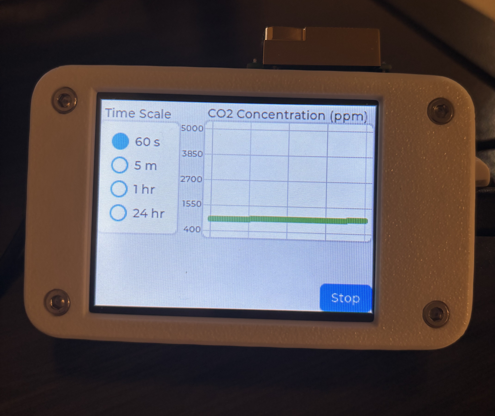

# CO2 Monitor


### Description
An ESP-32 device that monitors the CO2 level in the room and sends the infomation to a database in the cloud. A website will display the data.

### Impact
[Studies](https://www.sciencedirect.com/science/article/pii/S036013232300358X) have shown that short-term exposure to high levels of CO2 can reduce cognitive performance and negatively impact learning. Therefore, it is important to be ensure that CO2 levels remain low in an academic setting.

### Components
MH-Z19C CO2 Sensor ([more info](https://www.winsen-sensor.com/d/files/infrared-gas-sensor/mh-z19c-pins-type-co2-manual-ver1_0.pdf)) \
[by EC Buying](https://www.amazon.com/EC-Buying-Monitoring-Concentration-Detection/dp/B0CRKH5XVX)

ESP32 Cheap Yellow Display ([more info](https://www.lcdwiki.com/2.8inch_ESP32-32E_Display))\
[by Hosyond](https://www.amazon.com/gp/product/B0D92C9MMH)

3.7V LiPo Battery\
[by MakerHawk](https://www.amazon.com/gp/aw/d/B0D7MC714N)

### Features
* Screen automatically sleeps after 5 minutes of inactivity
* 1100 mAh battery with charging via the USB-C port (~6hr wireless battery life)
* Zero the CO2 sensor to 400 ppm by depressing the button for 7 seconds (only do this when outdoors)

### Dependencies
* Django for web app, API endpoint, and PostgreSQL database
* LVGL for ESP-32 GUI
* TFT_eSPI
* XPT2046_Touchscreen

### Web Hosting
* AWS EC2 for Django application
* AWS RDS for PostgreSQL

### Data Collection and Upload
Data will be in the following format:
```JSON
{"mode":"ambient","building":"COE","room_number":306,"unix_timestamp":1678886400,"CO2_ppm":750}
{"mode":"ambient","building":"COE","room_number":306,"unix_timestamp":1678886401,"CO2_ppm":760}
```
Samples will be taken every 1 second. The timestamp will be updated after each data POST request to keep the timestamps accurate over long periods of time. POST requests will be made every 5 minutes to reduce power usage and live data is already displayed on the CYD. A PostgreSQL database hosted in the cloud will be used to store the data.

### Pinout
| Pin | Use |
|-----|-----|
| IO35 | PWM for CO2 Sensor |
| 5V (UART PORT) | Vin for CO2 Sensor |
| GND | GND for CO2 Sensor |
| GND | GND for button -> CO2 Sensor HD Pin |

### CAD
Modified [ghfisanotti's CYD Case on Thingiverse](https://www.thingiverse.com/thing:7047135), licensed under CC BY-SA 3.0. See CAD folder in this repo for the STL and STEP files. 

### Required Parts and Assembly
* 1x ESP-32 CYD
* 1x MH-Z19C CO2 Sensor
* 1x 3.7 V Lipo w/ JST 1.25mm connector *optional
* 2x 1.25mm 4-pin JST to Dupont connectors
* 1x CYD_LID (3D printed)
* 1x CYD_BASE (3D printed)
* 4x M3 heat-set inserts
* 4x M3x8 bolts
* 1x [push button](https://www.amazon.com/Waterproof-Momentary-Button-Switch-Colors/dp/B07F24Y1TB) *optional, for zeroing the sensor
* 1x 5-pin female pin header *optional, for securing the sensor to the base

The 5-pin female pin header is secured by melting the plastic around it with a soldering iron. On the female pin header that the MH-Z19C's HD pin will plug into, solder a wire (this will connect to one pin of the button). Connect the other pin of the button to a GND pin on the CYD.

### Stretch Goals
* Dark Mode for ESP-32
* Handle http failure codes: handle extending batch size for POST failure, reattempt POST some number of times before clearing the buffer to avoid overflow. 
* ESP-32 timezone configuration for displayed time

### Data Visualization
* User should be able to search by building, room number, time (range, date)
* User should be able to see the most recent data in a plot (with the number of minutes since last data upload)
* User should be able to modify the parameters of the displayed plot (ex. time scale)
* Code should include a room score so the user can search for the rooms with the highest and lowest CO2 levels

### Temporary development notes
#### Tutorials 
[GUI Configs](https://randomnerdtutorials.com/lvgl-cheap-yellow-display-esp32-2432s028r) \
[LVGL Widgets Docs](https://docs.lvgl.io/master/widgets/)

#### TODO
* stop button logs whatever data is cached and goes back to start screen
* display elapsed time also if in session mode
* set building and room number to 'debug' when value is not given (so it can be filtered out in database)
* check if the plot can just be refreshed without loading new buffer (with flag for refresh without time scale change)
* first 1-2 mins make plot line blue to indicate sensor warming up
* make sure not to call get unix time twice when logging data (use same reference for displaying the time and logging data)
* stop button should disconnect wifi
* dont get unix time from load_buffers every time it is called, get unix time when making a post, increment the existing unix time from load_buffers instead since it is called once per second (create new variable for increment amount in case data logging interval changes in future)
* maybe use a finer time scale than seconds
* token protection for the POST (will configure this for the esp32 after the api code is written)
* create stylus holder loop next to usb-c port due to issue where the stylus can fall into the enclosure

#### Info
EC2 instance Django server running on:
http://107.23.179.9:8000/

Create virtual environment
```bash
python -m venv venv
```

activate the environment
```bash
source venv/bin/activate
```

Install PostgreSQL
```bash
sudo apt install postgresql postgresql-contrib
```

```bash
pip install -r requirements.txt
```

Create a .env inside of CO2 Dashboard, add the secrets, then run the server:
```bash
nohup python3 manage.py runserver 0.0.0.0:8000 &
```

Add the ip address to the allowed host list in setting.py.

stop old application
```bash
pkill -f "manage.py runserver"
```
